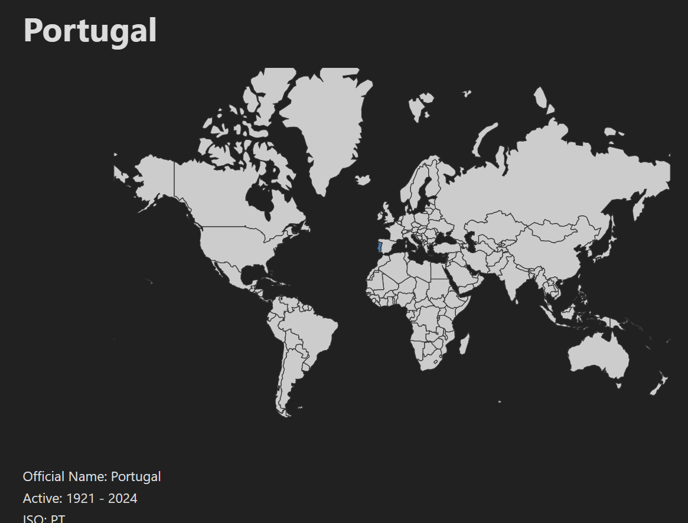
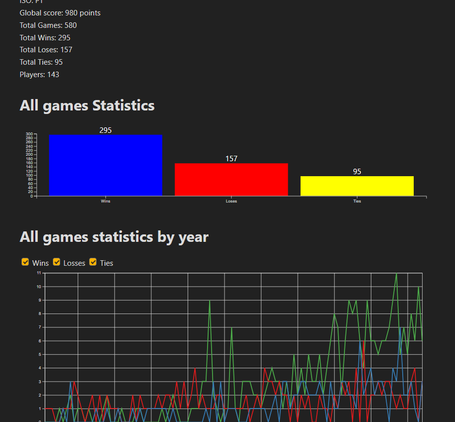
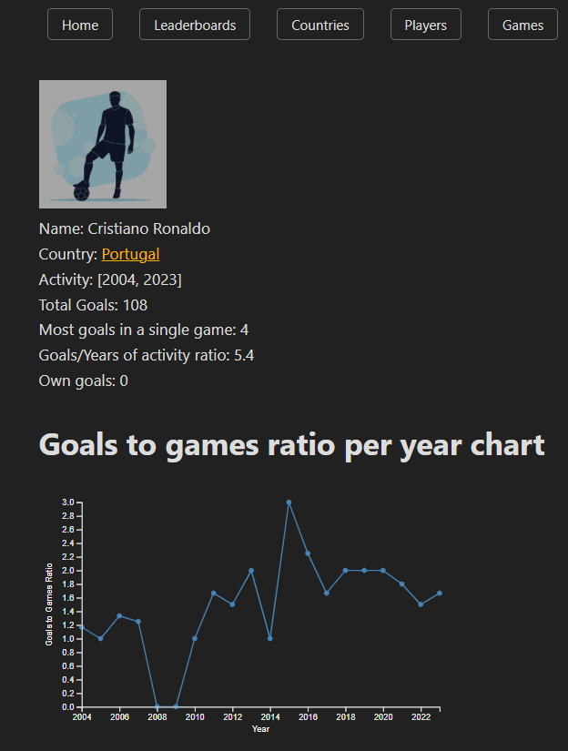
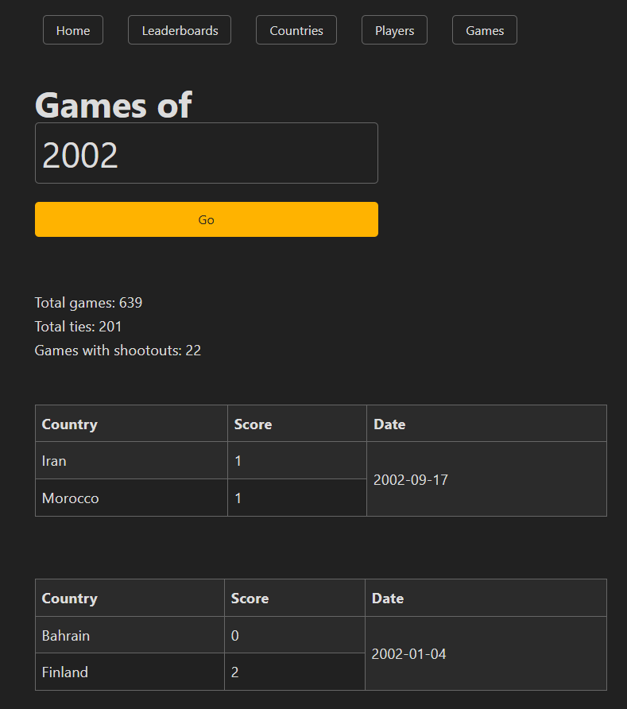
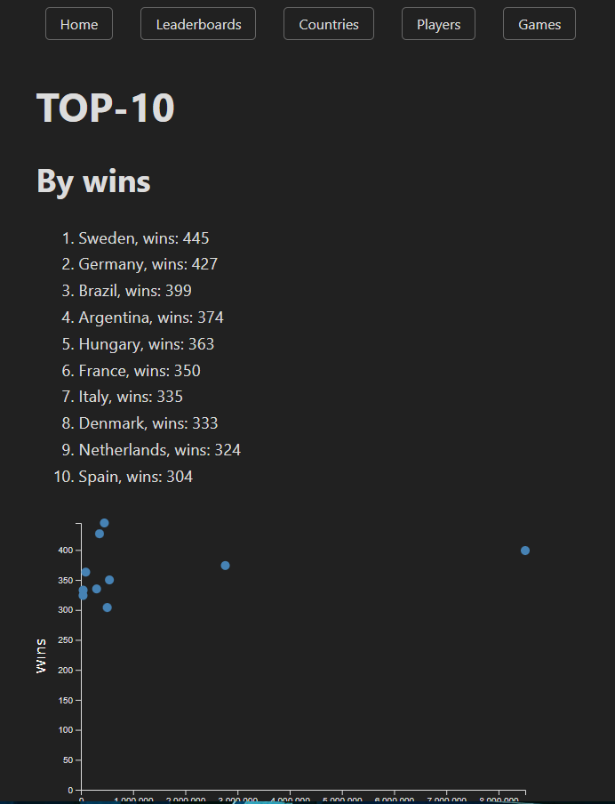

# Ballerina

## Football Statistics Application

This project consists of two main components: **FootballAppETL** and **Ballerina**.

---

## FootballAppETL
This is the ETL proccess written in Python.

1. **Create the Database**  
    Use your preferred SQL database and execute the `football.ddl` script located in the `FootballAppETL` directory.

2. **Run the ETL Script**  
    Execute `ETLscript.py` to populate the database.

---

## Ballerina
This is the backend of the application, developed with Ruby on Rails.

1. **Configure the Database**  
    Edit the `Ballerina/config/database.yml` file under the `development` section to set your database name, port, and other settings.

2. **Run Database Migrations**  
    Run `rails db:migrate` to apply the necessary migrations and set up your database schema.

3. **Start the Application**  
    Run `rails s` to start the server.

---

## Some snapshots from the app

